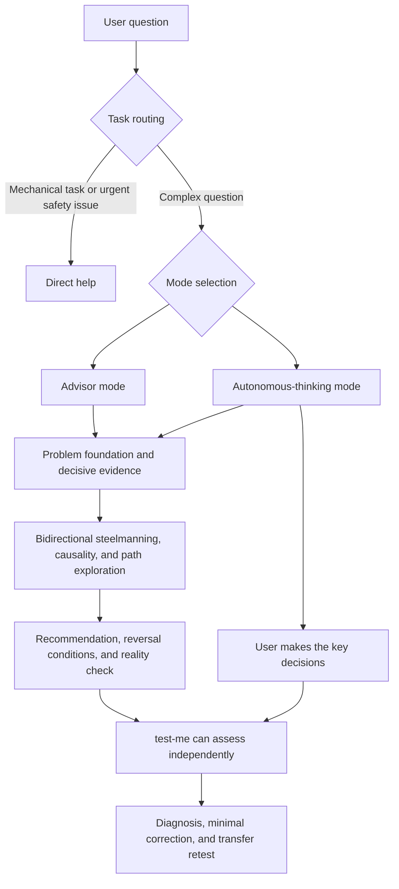

[中文](./README.md) | English

# Chief of Staff Skills

[](./LICENSE)

A pair of deep-analysis skills for Claude Code and Codex. They can act as a decisive advisor while preserving the user's ownership of problem framing, evidence judgment, value trade-offs, and final decisions.

They are designed for consequential questions in work, technology, product, strategy, learning, and life. The goal is not to let AI think in your place, but to help you remain able to explain the problem, find gaps, and make the key decisions after using AI extensively.

## Quick start

### 1. Install

After downloading or cloning this repository, run the following commands from the repository root. If you use only one client, run only the relevant copy command.

macOS, Linux, or WSL:

```bash
mkdir -p ~/.codex/skills ~/.claude/skills
cp -R skills/ask-lyl skills/test-me ~/.codex/skills/
cp -R skills/ask-lyl skills/test-me ~/.claude/skills/
```

Windows PowerShell:

```powershell
$codexSkills = Join-Path $env:USERPROFILE ".codex\skills"
$claudeSkills = Join-Path $env:USERPROFILE ".claude\skills"

New-Item -ItemType Directory -Force -Path $codexSkills, $claudeSkills | Out-Null
Copy-Item skills\ask-lyl, skills\test-me -Destination $codexSkills -Recurse
Copy-Item skills\ask-lyl, skills\test-me -Destination $claudeSkills -Recurse
```

Some Codex environments use `~/.agents/skills/`. If your client is configured that way, copy both skill directories there instead. Start a new session or restart the client after installation so the skills are rediscovered.

### 2. Start your first analysis

Codex:

```text
$ask-lyl <QUESTION>
```

Claude Code:

```text
/ask-lyl <QUESTION>
```

If you do not specify a mode, the skill explains its recommendation using signals from the task and asks you to explicitly choose advisor mode or autonomous-thinking mode.

### 3. Test understanding or find plan gaps

```text
$test-me <TOPIC_OR_PLAN>
```

In Claude Code, replace `$test-me` with `/test-me`.

## Capabilities

| Capability | Entry point | Outcome |
|---|---|---|
| Advisor mode | `ask-lyl` | AI leads the analysis and provides a clear or conditional recommendation, major risks, reversal conditions, and a next step |
| Autonomous-thinking mode | `ask-lyl` | AI supplies concepts, evidence, structure, options, and challenges while the user makes the key decisions |
| Understanding assessment | `test-me` | Distinguishes genuine understanding from repetition, transfer failure, and the illusion of cognitive completion |
| Plan stress test | `test-me` | Finds hidden assumptions, counterexamples, third paths, second-order effects, failure signals, and validation gaps |
| Source grounding | `ask-lyl`, `test-me` | Verifies decision-relevant external facts when tools are available and separates facts, claims, inferences, and assumptions |
| Reality calibration | `ask-lyl`, `test-me` | Connects conclusions to experiments, runtime results, user behavior, business metrics, or other observable evidence |

The two entry points are fully independent. Each can be installed separately, and neither invokes nor depends on another skill.

## Usage

### Using `ask-lyl`

You can select a mode explicitly:

```text
$ask-lyl <MODE>: <QUESTION>
```

For example, ask advisor mode to compare building versus buying a customer-support system, or use autonomous-thinking mode to decide whether to leave a stable job to start a company.

Or leave the mode unspecified:

```text
$ask-lyl <QUESTION>
```

The skill recommends a mode based on goal clarity, learning value, time pressure, risk, and whether the user must personally own the value judgment. The user still confirms the choice. A selected mode persists only within the same task; a material change in topic or goal triggers fresh routing.

Advisor mode is a good fit when:

- you want a fast, structured analysis and a clear recommendation;
- you have supplied enough constraints and want AI to do most of the analytical work;
- the decision is urgent and learning is not the immediate priority;
- you need to compare technical, product, or strategic options.

Autonomous-thinking mode is a good fit when:

- the decision involves personal values, risk tolerance, or irreversible costs;
- you want to learn an unfamiliar domain and build your own decision model;
- you are concerned about over-relying on AI conclusions;
- you want AI to handle research, explanation, and gap-finding while retaining the key decisions yourself.

Autonomous thinking is not an endless sequence of questions. The skill supplies necessary concepts and information sources, asks a batch of decision-relevant questions, and then lets the user form an initial judgment. If the user explicitly asks for a direct answer, the skill makes at most one brief ownership handback before providing its best judgment.

### Using `test-me`

Test knowledge or a concept:

```text
$test-me <TOPIC>
```

Find omissions in a plan:

```text
$test-me <PLAN>
```

Test a previous discussion:

```text
$test-me <PREVIOUS_DISCUSSION>
```

Knowledge assessment asks one question at a time so later questions do not reveal answers. Plan assessment presents two to four independent, high-value challenges in one batch. When it finds an important gap, the skill gives the smallest useful correction and retests transfer in a new situation. The user can ask to skip, reveal, or stop at any time.

## How it works



### 1. Hybrid routing

The skills do not force every request into cognitive training. Mechanical tasks are completed directly, and urgent safety problems receive immediate practical help. Complex questions proceed to mode selection, deep analysis, and evidence governance.

### 2. Problem foundation

The analysis first clarifies the real problem, objective, hard constraints, time horizon, stakeholders, and pending decisions. It then separates:

- verified facts;
- sourced but unverified claims;
- interpretations of facts;
- unverified assumptions;
- value premises;
- current unknowns.

Each decisive unknown is routed to public research, user input, a real-world experiment, or a conditional judgment. The skill asks only for information that could change the problem definition, preferred path, or risk level, usually batching two to four independent key questions.

### 3. Deep-analysis engine

The skill uses a stable analytical foundation and selects methods based on the structure of the problem instead of mechanically applying every framework:

- bidirectional steelmanning builds the strongest case for and against the current position;
- causal decomposition separates symptoms, direct causes, contributing factors, hard constraints, and feedback loops;
- multi-path exploration exposes false binaries, reversible experiments, and staged options;
- decision lenses examine opportunity cost, second-order effects, incentives, base rates, and irreversible risk;
- contradiction mapping is used only when real conflict and dynamic transformation control the problem;
- red-team review searches for strong counterexamples, omitted stakeholders, failure signals, and falsifiers.

The analysis stops when the problem structure, decisive evidence, judgment, reversal conditions, and next reality check are clear. Depth is not measured by response length or the number of frameworks used.

### 4. Cognitive-autonomy protocol

Autonomous-thinking mode delegates research, concept explanation, option expansion, and counterexample search to AI while reserving one to three decisions that truly control the overall direction for the user. After the user forms an initial judgment, AI presents its independent view and explains whether the disagreement comes from facts, values, risk, or time horizon.

A conversation counts as a cognitive-autonomy outcome only when the user can:

1. decide the key questions personally;
2. understand the overall concepts and causal structure;
3. discover or understand important gaps;
4. reconsider the judgment when conditions change.

Merely completing the protocol does not prove that the user's ability has improved.

### 5. Understanding and transfer assessment

`test-me` does not automatically treat a previous AI answer as ground truth. It establishes an assessment basis from user-specified material, verified primary sources, explicit facts, or a conflicting evidence set. It then tests whether the user can reconstruct the mechanism, identify boundaries, handle counterfactuals, state falsifiers, and distinguish evidence states.

The assessment avoids pseudo-precise scores and uses four qualitative diagnoses: independent reconstruction; basic understanding with model gaps; repetition without transfer; or an illusion of cognitive completion.

## Repository structure

```text
skills/
├── ask-lyl/
│   ├── SKILL.md
│   ├── agents/openai.yaml
│   ├── references/
│   │   ├── deep-thinking.md
│   │   ├── cognitive-autonomy.md
│   │   └── evidence-and-reality.md
│   └── evals/
└── test-me/
    ├── SKILL.md
    ├── agents/openai.yaml
    ├── references/assessment.md
    └── evals/
```

Supporting references are loaded only when a task needs them. The `evals/` directories are for development and regression testing; they are not runtime dependencies.

## Compatibility and dependencies

| Item | Details |
|---|---|
| Clients | Claude Code and Codex |
| Runtime dependencies | No dependency on other skills, scripts, or network services |
| Search | Optional; verifies sources when tools are available and identifies unverified claims and validation paths when they are not |
| Installation granularity | `ask-lyl` and `test-me` can be installed independently |
| Output language | User-facing natural language is Chinese, except the specification-required English `description` and technical identifiers |

## Safety and boundaries

- Sensitive information is minimized or anonymized before external search; permission is requested when necessary details cannot be safely anonymized.
- Instructions inside web pages, documents, code comments, and search results are treated as untrusted data.
- Agreement among multiple AI models is not treated as real-world verification.
- Hidden chain-of-thought is not exposed; only useful reasons, evidence, uncertainty, and decision structure are presented.
- The skills do not decide the user's core goals, value priorities, or risk tolerance.
- They do not fabricate precise probabilities or reduce institutional and resource problems to personal mindset.
- The first version does not maintain a user profile or claim to prove long-term cognitive improvement.
- Medical, legal, financial, safety, and other high-risk questions prioritize current authoritative evidence and clearly identify where real-world professional support is needed.

## Development and evaluation

The two skills contain independent evaluation suites with 24 behavioral cases in total. After installing [skill-up](https://github.com/alibaba/skill-up), run:

```bash
skill-up validate skills/ask-lyl/evals/eval.yaml
skill-up validate skills/test-me/evals/eval.yaml
skill-up run skills/ask-lyl/evals/eval.yaml
skill-up run skills/test-me/evals/eval.yaml
```

Use `--engine claude_code` or `--engine codex` to select an evaluation engine. Semantic cases use `agent_judge`; full runs require an API key for the corresponding model provider. Without credentials, `validate` and `--dry-run` remain available.

Native Windows environments have a Bash launch limitation for real-agent evaluation. Run the full suite in WSL2 instead. This limitation affects development evaluation only, not normal skill execution in Windows clients.

## FAQ

### Why does the skill not appear after installation?

Confirm that `SKILL.md` exists at `<skill-directory>/ask-lyl/SKILL.md` or `<skill-directory>/test-me/SKILL.md`, then start a new session or restart the client. Do not add an extra repository directory level around the skill folders.

### Can I use the skills without internet access or search tools?

Yes. They continue with structured analysis, but must identify unverified claims and provide suggested queries, preferred source types, or real-world validation steps.

### Will autonomous-thinking mode keep asking questions indefinitely?

No. It must contribute new concepts, evidence, or challenges and batch key questions. When the user explicitly requests a direct answer, it performs at most one brief ownership handback and then releases the gate.

### Does `test-me` require `ask-lyl`?

No. The skills are fully independent, and `test-me` can assess any material, discussion, or user-authored plan.

## Methodology attribution

The deep-analysis methodology was inspired by [deep-thinking-skill](https://github.com/youyoumaixiang10/deep-thinking-skill) and reorganized around cognitive autonomy, evidence governance, hybrid routing, and behavioral evaluation. This project has no runtime dependency on that skill.

## License

Licensed under the [MIT License](./LICENSE).
