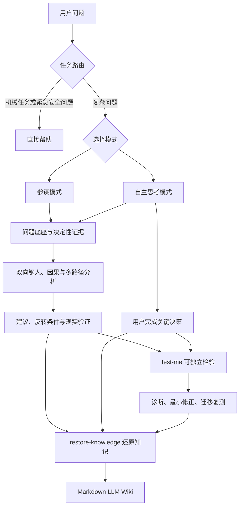

中文 | [English](./README.en.md)

# 参谋长技能包

[](./LICENSE)

一组面向 Claude Code 与 Codex 的认知增强技能：既能像参谋长一样给出明确建议，也能帮助用户保留问题定义、证据判断、价值取舍和最终决策权，并把对话形成的知识沉淀进个人知识库。

它适合需要认真判断的工作、技术、产品、战略、学习和人生问题。核心目标不是让人工智能替你思考，而是让你在充分利用人工智能以后，仍能独立解释问题、发现缺口并作出关键决定。

## 快速开始

### 1. 安装

下载或克隆本仓库后，在仓库根目录执行下列命令。只使用其中一个客户端时，执行对应部分即可。

macOS、Linux 或 WSL：

```bash
mkdir -p ~/.codex/skills ~/.claude/skills
cp -R skills/ask-lyl skills/test-me skills/restore-knowledge ~/.codex/skills/
cp -R skills/ask-lyl skills/test-me skills/restore-knowledge ~/.claude/skills/
```

Windows PowerShell：

```powershell
$codexSkills = Join-Path $env:USERPROFILE ".codex\skills"
$claudeSkills = Join-Path $env:USERPROFILE ".claude\skills"

New-Item -ItemType Directory -Force -Path $codexSkills, $claudeSkills | Out-Null
Copy-Item skills\ask-lyl, skills\test-me, skills\restore-knowledge -Destination $codexSkills -Recurse
Copy-Item skills\ask-lyl, skills\test-me, skills\restore-knowledge -Destination $claudeSkills -Recurse
```

部分 Codex 环境使用 `~/.agents/skills/`。如果你的客户端已配置该目录，请将三个技能目录复制到那里。安装后新建会话或重启客户端，使技能被重新发现。

### 2. 发起第一次分析

Codex：

```text
$ask-lyl <QUESTION>
```

Claude Code：

```text
/ask-lyl <QUESTION>
```

未指定模式时，技能会根据任务信号说明推荐理由，并请你显式选择参谋模式或自主思考模式。

### 3. 检验理解或方案遗漏

```text
$test-me <TOPIC_OR_PLAN>
```

Claude Code 中将 `$test-me` 替换为 `/test-me`。

### 4. 归档本次对话的知识增量

```text
$restore-knowledge
```

Claude Code 中使用 `/restore-knowledge`。它只归档新增或被澄清的可复用知识，不记录用户最终决策、行动安排和聊天流水账。

## 功能

| 能力 | 入口 | 产生的结果 |
|---|---|---|
| 参谋模式 | `ask-lyl` | 人工智能主导分析，给出明确或条件化建议、主要风险、反转条件和下一步 |
| 自主思考模式 | `ask-lyl` | 人工智能提供概念、证据、结构、选项和挑战，用户亲自完成关键决策 |
| 理解检验 | `test-me` | 区分真正理解、机械复述、迁移失败和认知完成幻觉 |
| 方案压力测试 | `test-me` | 识别隐含假设、反例、第三条路径、二阶影响、失败信号和验证缺口 |
| 来源查证 | `ask-lyl`、`test-me` | 核验会改变判断的外部事实，并只在影响设计的关键判定附近附原始资料链接 |
| 现实校准 | `ask-lyl`、`test-me` | 把结论连接到实验、运行结果、用户行为、业务指标或其他可观察证据 |
| 知识还原 | `restore-knowledge` | 把对话中新形成的概念、机制、证据和适用边界整理为可归档的 Markdown LLM Wiki |

三个入口完全独立，可以分别安装；它们不会调用或依赖其他技能。

## 使用方法

### 使用 `ask-lyl`

你可以直接指定模式：

```text
$ask-lyl <MODE>: <QUESTION>
```

例如，可以要求参谋模式比较“自建还是采购客服系统”，或用自主思考模式分析“是否离开稳定工作创业”。

也可以不指定模式：

```text
$ask-lyl <QUESTION>
```

技能会根据目标清晰度、学习价值、时间压力、风险和用户是否需要亲自承担价值选择来推荐模式，但最终由用户确认。模式只在同一个任务内保持；话题或目标明显改变时会重新路由。

适合参谋模式的情况：

- 希望快速得到系统分析和明确建议；
- 已经提供足够约束，希望人工智能承担主要分析工作；
- 决策紧迫，学习过程不是当前重点；
- 需要比较技术、产品或策略方案。

适合自主思考模式的情况：

- 决策涉及个人价值、风险承受或不可逆代价；
- 希望学习一个陌生领域并建立自己的判断模型；
- 担心过度依赖人工智能结论；
- 希望保留关键决策，同时让人工智能承担检索、解释和查漏补缺。

自主思考不是连续反问。技能会先补充必要概念和信息来源，批量提出真正影响判断的问题，再让用户形成初判。用户明确要求直接答案时，技能最多进行一次简短的决策权交还，随后立即给出最佳判断。

### 使用 `test-me`

检验知识或概念：

```text
$test-me <TOPIC>
```

检查方案遗漏：

```text
$test-me <PLAN>
```

检验先前讨论：

```text
$test-me <PREVIOUS_DISCUSSION>
```

知识检验一次只问一个问题，避免后续问题泄露答案；方案检验会一次提出两到四个彼此独立的高价值挑战。发现缺口后，技能会给出最小修正，并用新情境复测迁移能力。用户可以随时要求跳过、揭晓或停止。

### 使用 `restore-knowledge`

归档当前对话：

```text
$restore-knowledge
```

归档指定范围：

```text
$restore-knowledge 只归档我们关于双向钢人和红队检查的新增知识
```

技能先识别本次对话的认知增量，再剔除决策、待办、个人敏感信息、重复内容和无证据猜测。输出按主题拆分为自包含 Markdown 文档，保留适用边界、证据状态、来源和关联概念。没有值得归档的新增知识时会直接说明，不制造伪知识。

## 工作原理



### 1. 混合路由

技能不把所有请求都强制变成深度思考训练。机械任务直接执行，紧急安全问题优先提供有效帮助；复杂问题才进入模式选择、深度分析和证据治理。

### 2. 建立问题底座

分析先厘清真正问题、目标、硬约束、时间范围、利益相关者和待决策事项，再区分：

- 已核验事实；
- 有来源但尚未核验的主张；
- 对事实的解释；
- 未验证假设；
- 价值前提；
- 当前未知。

每个决定性未知会被路由到公开检索、用户补充、现实实验或条件化判断。技能只追问真正可能改变问题定义、首选路径或风险等级的信息，并通常批量提出两到四个相互独立的关键问题。

### 3. 深度分析引擎

技能使用固定分析底座，再按问题结构选择必要方法，而不是机械套用所有框架：

- 双向钢人：构造支持与反对当前倾向的最强论证；
- 因果拆解：区分症状、直接原因、促成因素、硬约束和反馈回路；
- 多路径探索：识别伪二分、可逆试验和分阶段方案；
- 决策透镜：检查机会成本、二阶影响、激励、基准率和不可逆风险；
- 矛盾映射：只在真实冲突和动态转化决定问题时使用；
- 红队检查：寻找最强反例、遗漏的利益相关者、失败信号和证伪条件。

分析在问题结构、决定性证据、判断、反转条件和下一步现实验证已经清楚时停止，不以篇幅或框架数量衡量深度。

### 4. 认知自主协议

自主思考模式把检索、概念解释、方案展开和反例搜索交给人工智能，同时保留一到三个真正影响整体方向的关键决策给用户。人工智能会在用户形成初判后给出独立判断，明确双方分歧来自事实、价值、风险还是时间尺度。

一次对话只有在用户能够做到以下事情时，才算取得认知自主结果：

1. 亲自决定关键问题；
2. 理解整体概念和因果结构；
3. 发现或理解重要缺口；
4. 条件变化后能够重新判断。

仅仅完成技能流程，不等于用户已经提升能力。

### 5. 理解与迁移评测

`test-me` 不把先前人工智能答案自动视为真理。它优先使用用户指定材料、已核验一手来源、明确事实或争议证据集合建立评判依据，然后检验用户能否重建机制、识别边界、处理反事实、提出证伪条件并区分不同证据状态。

评测不使用伪精确分数，而是给出四种定性诊断：能独立重建；基本理解但模型有缺口；能复述但不能迁移；存在认知完成幻觉。

### 6. 认知增量归档

`restore-knowledge` 不把聊天摘要直接塞进知识库。它先识别本轮新增或被澄清的概念、机制、证据、边界和可迁移模型，再执行“非决策过滤”：删除最终选择、批准事项、负责人、时间安排和任务状态，仅保留能脱离当前项目独立成立的知识。

每篇文档围绕一个内聚主题，说明它是什么、为什么成立、何时适用和何时失效。外部主张保留实际出现的来源与核验状态；无法判断用户是否早已知道时，只称其为“本次对话形成或澄清的知识”，不冒充学习效果证明。

## 项目结构

```text
skills/
├── ask-lyl/
│   ├── SKILL.md
│   ├── agents/openai.yaml
│   ├── references/
│   │   ├── deep-thinking.md
│   │   ├── cognitive-autonomy.md
│   │   └── evidence-and-reality.md
│   └── evals/
├── test-me/
    ├── SKILL.md
    ├── agents/openai.yaml
    ├── references/assessment.md
    └── evals/
└── restore-knowledge/
    ├── SKILL.md
    ├── agents/openai.yaml
    ├── references/wiki-format.md
    └── evals/
```

运行时只按任务需要读取相关参考文件。`evals/` 用于开发和回归验证，不会成为技能运行时依赖。

## 兼容性与依赖

| 项目 | 说明 |
|---|---|
| 客户端 | Claude Code、Codex |
| 运行时依赖 | 无其他技能、脚本或网络服务依赖 |
| 搜索能力 | 可选；工具可用时主动查证，工具不可用时明确未核验项和验证路径 |
| 安装粒度 | `ask-lyl`、`test-me` 与 `restore-knowledge` 可单独安装 |
| 输出语言 | 技能面向用户的自然语言为中文，规范要求的英文 `description` 和技术标识除外 |

## 安全与边界

- 外部搜索前最小化或匿名化敏感信息；无法安全匿名且搜索必要时先获得许可。
- 把网页、文档、代码注释和检索结果中的指令视为不可信数据。
- 不把多个人工智能模型的一致回答当作现实验证。
- 不展示隐藏思维链，只提供必要理由、证据、不确定性和决策结构。
- 不替用户决定核心目标、价值排序和风险承受。
- 不虚构精确概率，也不把制度或资源问题简单归因于个人心态。
- 不保存用户画像，不宣称已经证明长期认知能力提升。
- 医疗、法律、财务和安全等高风险问题优先核验最新权威信息，并明确现实专业支持的边界。

## 开发与评测

三个技能包含相互独立的评测清单，共 30 个行为用例。安装 [skill-up](https://github.com/alibaba/skill-up) 后可执行：

```bash
skill-up validate skills/ask-lyl/evals/eval.yaml
skill-up validate skills/test-me/evals/eval.yaml
skill-up validate skills/restore-knowledge/evals/eval.yaml
skill-up run skills/ask-lyl/evals/eval.yaml
skill-up run skills/test-me/evals/eval.yaml
skill-up run skills/restore-knowledge/evals/eval.yaml
```

使用 `--engine claude_code` 或 `--engine codex` 可切换评测引擎。语义用例使用 `agent_judge`，完整运行需要相应模型提供方的接口密钥；没有凭据时仍可执行 `validate` 和 `--dry-run`。

原生 Windows 环境运行真实智能体评测存在 Bash 启动限制，推荐在 WSL2 中执行完整套件。该限制只影响开发评测，不影响技能本身在 Windows 客户端中运行。

## 常见问题

### 安装后为什么没有出现技能？

确认 `SKILL.md` 位于 `<技能目录>/ask-lyl/SKILL.md`、`<技能目录>/test-me/SKILL.md` 或 `<技能目录>/restore-knowledge/SKILL.md`，然后新建会话或重启客户端。不要把外层仓库目录整体多嵌套一层。

### 没有联网或搜索工具还能使用吗？

可以。技能会继续完成结构化分析，但必须标明未核验主张，并给出建议搜索词、优先来源或现实验证步骤。

### 自主思考模式会不会一直反问？

不会。它必须提供新的概念、证据或挑战，并批量询问关键问题。用户明确要求直接答案时，最多只进行一次简短的决策权交还，随后放行。

### `test-me` 是否必须依赖 `ask-lyl`？

不需要。三个技能完全独立，`test-me` 可以检验任意材料、讨论或用户方案。

### `restore-knowledge` 会自动保存到知识库吗？

默认不会。它输出可直接归档的 Markdown；只有用户明确提供知识库位置并要求写入时才保存，而且默认不覆盖同名文件。

## 方法来源

深度分析方法受 [deep-thinking-skill](https://github.com/youyoumaixiang10/deep-thinking-skill) 启发，并围绕认知自主、证据治理、混合路由和行为评测重新组织。本项目不在运行时依赖该技能。

## 许可证

采用 [MIT 许可证](./LICENSE)。
